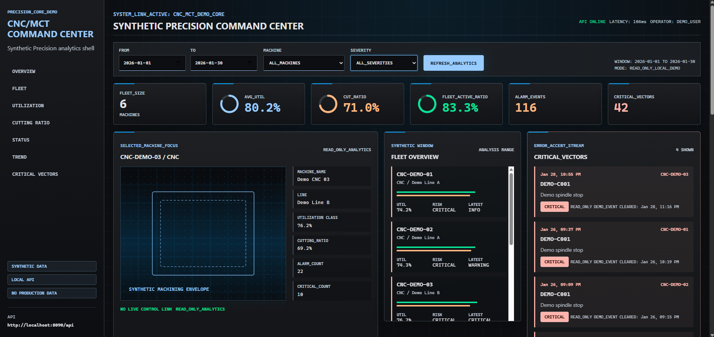
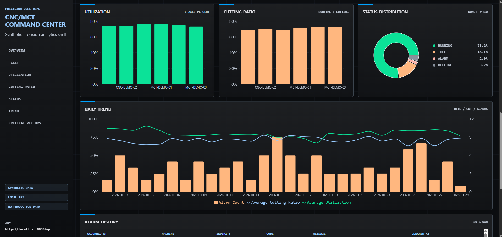
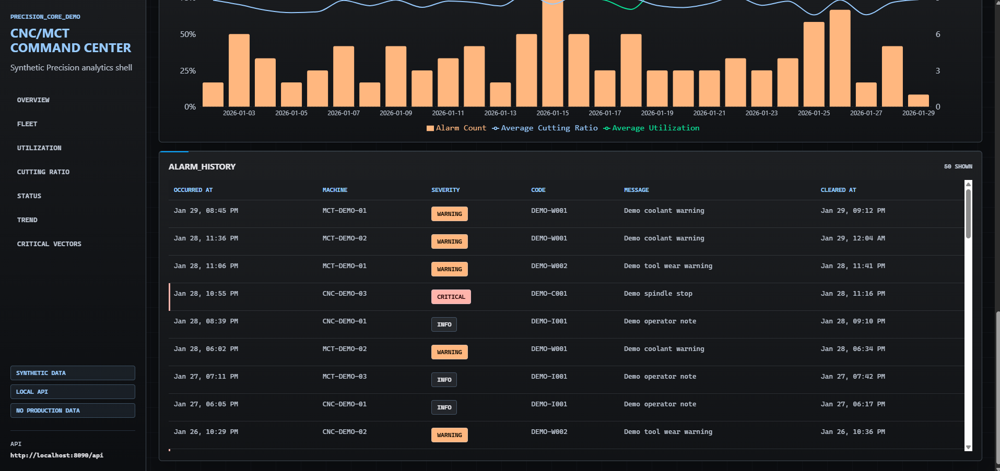
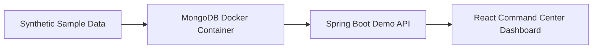
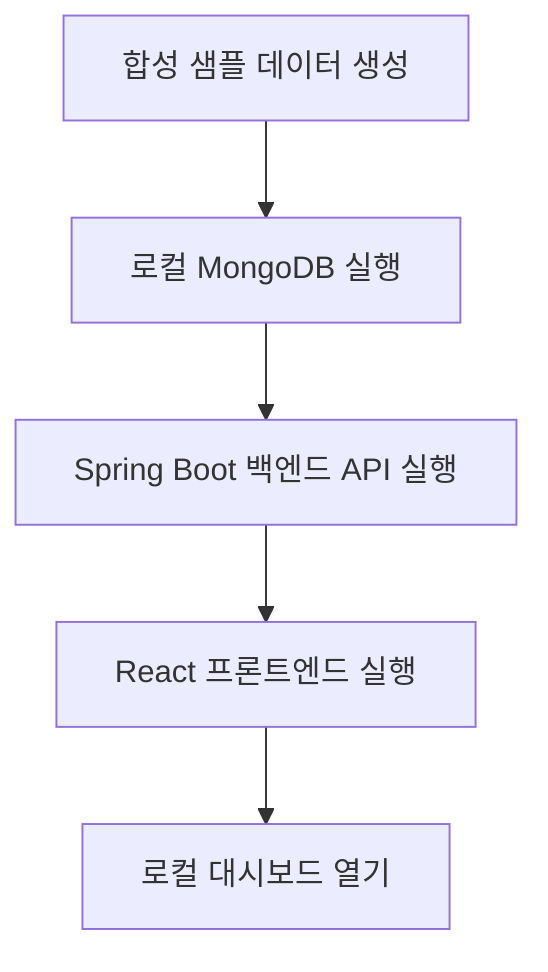

# CNC/MCT Analytics Dashboard Demo

Spring Boot 백엔드, MongoDB 샘플 데이터셋, React 프론트엔드로 구성한 CNC/MCT 제조 설비 분석 대시보드 데모입니다.

이 저장소는 실제 운영·배포된 CNC/MCT 제조 대시보드 프로젝트의 아키텍처, 대시보드 워크플로, 엔지니어링 경험을 기반으로 공개용으로 재구성한 데모입니다.

운영 소스코드를 그대로 복사한 것이 아니며, 운영 데이터, 고객 데이터, 실제 DB 연결, 실제 설비 이력, 서버 IP, 인증 정보, 로그, 인증서, 비공개 환경값은 포함하지 않습니다.

모든 데모 데이터는 합성 샘플 데이터입니다.

## 개요

로컬 환경 전용 제조 설비 모니터링·운영 분석 대시보드 데모입니다. 다음 분석 영역에 집중합니다:

- 설비 가동률
- 가동시간(RunTime) 대비 절삭시간(CutTime) 비율
- 알람 이력
- 설비 상태 분포
- 일별 추세 차트
- KPI 카드 및 차트 기반 대시보드 뷰

프론트엔드는 다크 테마의 `Synthetic Precision` 커맨드 센터 인터페이스를 사용합니다. 읽기 전용이며, 운영 환경의 실시간 카메라·G-code·생산 제어·현장 전용 기능은 로컬 데모 API에서 파생된 합성 분석 패널로 대체했습니다.

## 운영 배경

이 저장소는 운영·배포된 CNC/MCT 제조 대시보드 프로젝트 경험을 기반으로 재구성했습니다.

원본 운영 시스템은 제조 설비 데이터, 대시보드 API, 설비 가동률 지표, 가동시간/절삭시간 분석, 알람 이력, 설비 상태 분포, 운영 추세 뷰를 다루었습니다.

이 저장소는 운영 시스템의 1:1 복사본이 아닙니다. 핵심 엔지니어링 개념은 유지하되, 운영 환경 특화 구현은 합성 데이터, 단순화된 로컬 런타임 구성요소, 읽기 전용 데모 화면으로 대체했습니다.

익명화된 케이스 스터디: [CNC/MCT Manufacturing Dashboard Case Study](docs/CASE_STUDY_CNC_MCT_DASHBOARD.md)

## 담당 역할

**역할: 단독 개발**

- Spring Boot 백엔드 API 설계 및 구현
- React + TypeScript 대시보드 프론트엔드 설계 및 구현
- MongoDB 데모 스키마 및 합성 샘플 데이터셋 설계
- 설비 가동률 분석 구현
- 가동시간/절삭시간 비율 대시보드 로직 구현
- 알람 이력 분석 및 설비 상태 분포 뷰 구현
- KPI 카드 및 차트 기반 대시보드 패널 구현
- 실제 운영 대시보드 프로젝트의 아키텍처와 워크플로를 기반으로 공개 데모 재구성

## 기술 스택

| 영역 | 스택 |
| --- | --- |
| Frontend | Vite, React, TypeScript |
| 차트 시각화 | Recharts |
| Backend | Spring Boot 3.x (Java 17) |
| Database | MongoDB |
| 샘플 데이터 | Python seed script, JSON |
| 로컬 런타임 | Docker Compose |
| 빌드 도구 | Gradle, npm |

## 스크린샷

### Command Center Overview



### Analytics Panels



### Alarm History



## 아키텍처



운영 프로젝트는 동일한 대시보드 개념을 따랐지만, 실제 운영 데이터, 실제 설비 인터페이스, 운영 인증, 배포 환경 특화 인프라를 사용했으며 이는 이 저장소에 포함되지 않습니다.

## 로컬 데모 흐름



## 저장소 구조

```text
cnc-mct-analytics-dashboard-demo
├─ backend/                 # Spring Boot 데모 API
├─ frontend/                # React + TypeScript 대시보드
├─ sample-data/             # 합성 JSON 샘플 데이터
├─ scripts/                 # 데이터 생성 및 런타임 테스트 스크립트
├─ screenshots/             # 공개 데모 스크린샷
├─ docs/                    # 아키텍처, API, 스키마, 보안, 데이터 고지
├─ docker-compose.yml       # 로컬 MongoDB 런타임
└─ README.md
```

## 핵심 엔지니어링 포인트

- **공개 데모 재구성**: 운영 소스코드 덤프가 아니라, 핵심 대시보드 아키텍처와 분석 워크플로를 유지하면서 공개용으로 재구성했습니다.
- **합성 제조 데이터셋**: 실제 설비 이력이나 고객 데이터 노출 없이 CNC/MCT 대시보드 시나리오를 표현하도록 설계했습니다.
- **읽기 전용 분석 API**: 포트폴리오 검토 및 로컬 테스트를 위한 읽기 전용 대시보드 API를 제공합니다.
- **요약 데이터 기반 성능 설계**: 일별 요약(`daily_summary`) 데이터를 사전 집계해 대시보드 조회 시 원천 이벤트를 매번 스캔하지 않도록 설계했습니다.
- **보안을 고려한 공개 범위 통제**: 운영 소스코드, 인증 정보, 비공개 인프라 값, 고객 데이터, 로그, 인증서, 비공개 Git 히스토리를 의도적으로 제외했습니다.

## 샘플 데이터

로컬 합성 샘플 데이터 생성:

```bash
python scripts/generate_sample_data.py
```

`sample-data/`에 생성된 파일은 데모용 가짜 레코드이며, 실제 운영 시스템에서 복사한 데이터가 아닙니다.

합성 샘플 컬렉션:

- `machines`
- `status_history`
- `runtime_cuttime`
- `alarm_history`
- `daily_summary`

## 백엔드

Spring Boot 백엔드는 `backend/`에 있으며, 합성 MongoDB 컬렉션에 대한 읽기 전용 데모 API를 제공합니다.

기본 설정:

| 항목 | 값 |
| --- | --- |
| Java | 17 |
| Spring Boot | 3.x |
| 서버 포트 | `8090` |
| MongoDB URI | `${MONGODB_URI:mongodb://localhost:27017/cnc_mct_demo}` |
| CORS Origins | `http://localhost:3000`, `http://localhost:5173` |

Gradle wrapper로 실행:

```powershell
cd backend
.\gradlew.bat bootRun
```

빌드:

```powershell
cd backend
.\gradlew.bat build
```

백엔드는 시작 시 대상 컬렉션이 비어 있을 때만 `sample-data/*.json`을 MongoDB로 임포트합니다. 로더는 저장소 루트와 `backend/` 디렉터리 양쪽에서 동작합니다.

엔드포인트 상세와 응답 예시는 [docs/API.md](docs/API.md) 참고.

## 프론트엔드

React 프론트엔드는 `frontend/`에 있으며, `VITE_API_BASE_URL`을 통해 백엔드 API를 호출합니다.

기본 API URL:

```env
VITE_API_BASE_URL=http://localhost:8090/api
```

실행:

```powershell
cd frontend
npm install
npm run dev
```

접속:

```text
http://localhost:5173
```

빌드:

```powershell
cd frontend
npm run build
```

프론트엔드는 공개 데모를 위해 읽기 전용으로 구성되었습니다. 인증, JWT 처리, 사용자 관리, 파일 업로드/다운로드, mock fallback이 없으며, API 오류는 화면에 표시됩니다.

상세는 [docs/FRONTEND.md](docs/FRONTEND.md) 참고.

## 로컬 런타임

MongoDB 실행:

```powershell
docker compose up -d mongo
```

백엔드 실행:

```powershell
cd backend
.\gradlew.bat bootRun
```

새 PowerShell 세션에서 프론트엔드 실행:

```powershell
cd frontend
npm install
npm run dev
```

접속:

```text
http://localhost:5173
```

저장소 루트에서 백엔드 API 스모크 테스트:

```powershell
.\scripts\test_backend_api.ps1
```

전체 런타임 테스트 흐름과 트러블슈팅은 [docs/RUNTIME_TEST.md](docs/RUNTIME_TEST.md) 참고.

## 보안 및 데이터 고지

이 저장소의 모든 데모 데이터는 합성 샘플 데이터입니다. 설비명, 식별자, 타임스탬프, 알람 레코드, 가동률 값, KPI 값 등은 모두 데모 전용 값이며, 운영 데이터·고객 데이터·실제 설비 이력을 노출하지 않습니다.

다음 항목은 이 저장소에 추가하지 마십시오:

- 운영 `.env` 파일 / 실제 DB URI / 서버 IP
- 인증 정보 / API 키 / 인증서 / 로그 / DB 덤프
- 운영 소스코드 / 운영 Git 히스토리
- 고객 스크린샷 / 실제 설비 데이터 / 고객별 운영 레코드

상세: [Security Notice](docs/SECURITY.md) · [Data Notice](docs/DATA_NOTICE.md)

## 공개 데모 한계

이 데모는 공개 포트폴리오 용도로 안전하게 유지하기 위해 의도적으로 다음을 제외했습니다: 운영 인증/인가, 실제 설비 인터페이스, 실시간 운영 데이터 연결, 고객별 대시보드 로직, 운영 배포 스크립트, 비공개 인프라 구성, 운영 Git 히스토리.

## 문서

| 문서 | 설명 |
| --- | --- |
| [Architecture](docs/ARCHITECTURE.md) | 시스템 아키텍처 및 데이터 흐름 |
| [API Reference](docs/API.md) | 백엔드 API 엔드포인트 및 응답 형식 |
| [Frontend](docs/FRONTEND.md) | 프론트엔드 구조 및 런타임 노트 |
| [Runtime Test](docs/RUNTIME_TEST.md) | 로컬 런타임 테스트 흐름 및 트러블슈팅 |
| [Data Schema](docs/DATA_SCHEMA.md) | MongoDB 데모 스키마 및 컬렉션 구조 |
| [Security Notice](docs/SECURITY.md) | 보안, 익명화, 공개 정책 |
| [Data Notice](docs/DATA_NOTICE.md) | 합성 데이터 및 데이터 처리 고지 |
| [Case Study](docs/CASE_STUDY_CNC_MCT_DASHBOARD.md) | 익명화된 CNC/MCT 대시보드 케이스 스터디 |
| [Reuse Candidates](docs/REUSE_CANDIDATES.md) | 재사용 가능 모듈 및 확장 후보 |

## 라이선스 / 사용

공개 포트폴리오 데모로 제공됩니다. 일부라도 재사용하기 전에 저장소 라이선스와 보안 고지를 확인하십시오.
